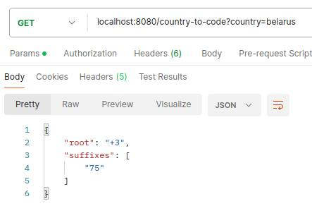

# BSUIR-Java labs
 
## Лабораторная работа №1 
Создание простейшего сервиса с помощью Spring Boot

**Тема:** сервис принимает название страны и возвращает телефонный код

**Технологии:** OpenJDK 21, Spring Boot 3.2.3, Maven 

Пример запроса:
```bash
localhost:8080/country-to-code?country={country}
```

